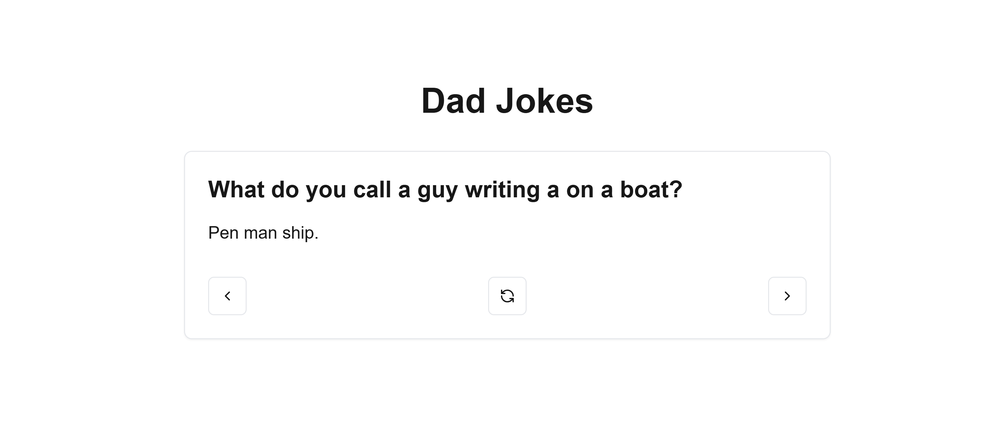

# Dad Jokes

🚀 A web app that fetches and displays funny dad jokes from Reddit, randomly generated at the click of a button.

## Table of contents

- [Dad Jokes](#dad-jokes)
  - [Table of contents](#table-of-contents)
  - [Overview](#overview)
    - [The challenge](#the-challenge)
    - [Links](#links)
  - [My process](#my-process)
    - [Built with](#built-with)
    - [What I learned](#what-i-learned)
    - [Current UI](#current-ui)
    - [Continued development](#continued-development)
  - [Author](#author)

## Overview

### The challenge

- Build a web app to fetch dad jokes from the r/dadjokes subreddit using ZenRows API and display them randomly.
- Implement server-side data fetching with Next.js and TypeScript.

### Links

- Solution URL: [GitHub Repo](https://github.com/dpkreativ/dad-jokes)
- Live Site URL: [Live Demo](https://dad-jokes-dusky.vercel.app/)

## My process

### Built with

- [Next.js](https://nextjs.org/) - React framework
- [ZenRows API](https://www.zenrows.com/) - For scraping Reddit
- [TypeScript](https://www.typescriptlang.org/) - For type safety
- Fetch API - For HTTP requests

### What I learned

- How to fetch data on the server-side with Next.js and render it on the frontend.
- The ZenRows API is great for scraping data from websites without needing to set up complex scraping logic.
- Handling asynchronous data fetching with TypeScript for better error handling and type safety.

### Current UI

### Continued development

- Add error handling for cases where jokes fail to load.
- Implement pagination to load more jokes dynamically.
- Improve UI styling for a better user experience.

## Author

- Website - [Divine Orji](https://dpkreativ.vercel.app)
- X (Twitter) - [@dpkreativ](https://www.x.com/dpkreativ)